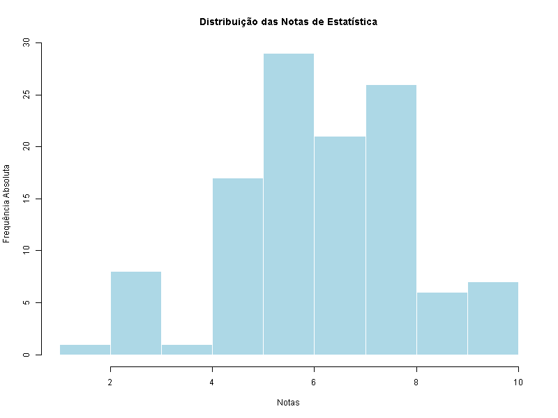
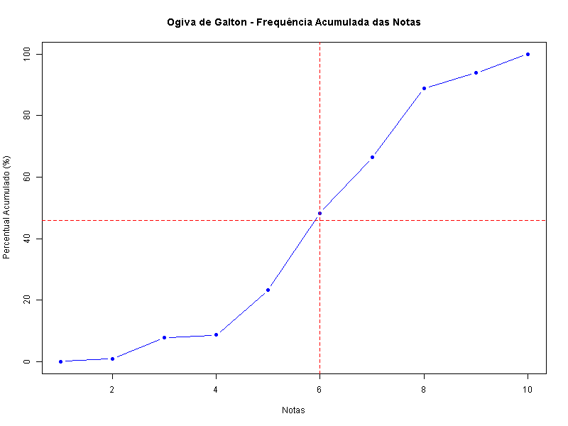
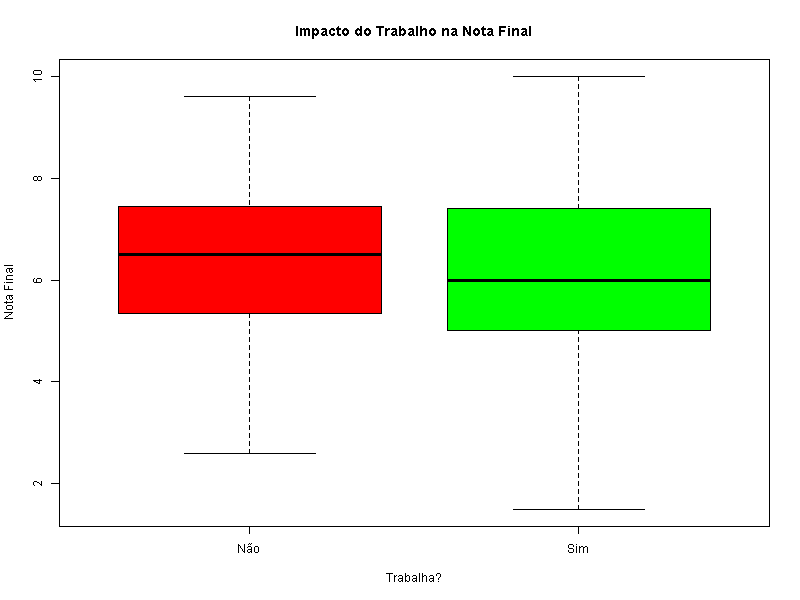
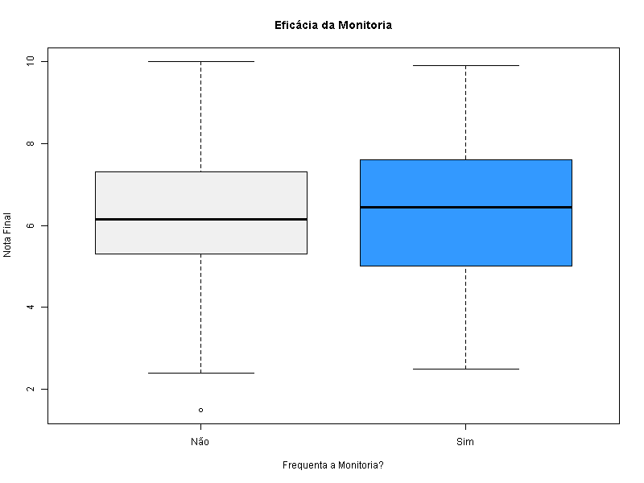

# 📊 Diagnóstico de Desempenho Acadêmico - PBL 01

Análise estatística exploratória utilizando a linguagem **R** para identificar fatores de risco e propor intervenções pedagógicas baseadas em dados.

### 📈 Destaques do Diagnóstico (PBL 01)

A análise processou uma amostra de **120 alunos** para identificar padrões de retenção. Os principais pontos identificados foram:

  * **Zona de Risco:** A **Ogiva de Galton** revelou que **46%** da turma está abaixo da média 6.0.
  * **Perfil Socioeconômico:** **58,33%** dos discentes conciliam estudos e trabalho, o que correlaciona com a baixa adesão à monitoria presencial.
  * **Eficácia da Monitoria:** Alunos que utilizam o suporte apresentam desempenho superior (média **6,28** vs **5,65**).

#### 🖼️ Visualizações Principais

| Distribuição das Notas | Análise de Risco (Ogiva) |
| :---: | :---: |
|  |  |

| Impacto do Trabalho | Eficácia da Monitoria |
| :---: | :---: |
|  |  |

> 📄 **Confira o [Relatório Completo](relatorio.md)** para uma análise detalhada das propostas de intervenção e cruzamento de variáveis.

### 2\. Tabela de Eficácia da Monitoria

Se quiser dar mais peso visual ao dado de que a monitoria eleva a média para **6,28**, você pode incluir a segunda tabela de imagens que está no seu relatório:

### 🛠️ Tecnologias Utilizadas

-   **Linguagem:** R
-   **Ambiente:** RStudio
-   **Documentação:** Markdown

-----
**Obs.:** Trabalho apresentado como requisito avaliativo na disciplina Probabilidade e Estatística, ministrada pelo Prof. Hidelbrando Ferreira Rodrigues, no Curso de Engenharia de Software do Instituto de Ciências Exatas e Tecnologia-ICET de Itacoatiara/AM, Universidade Federal do Amazonas-UFAM

**Discente**: Raul Berger de Andrade Lima
