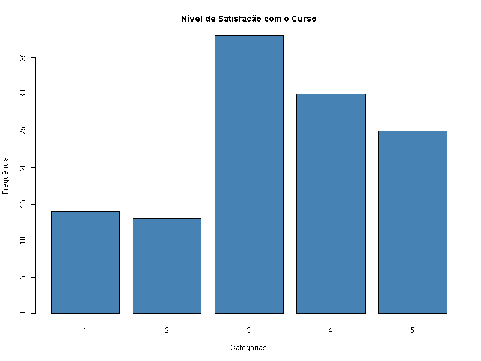

# 📊 Análise de Desempenho Acadêmico: Disciplina de Estatística Aplicada à Engenharia

## 📝 1. Situação-Problema

A coordenação dos cursos de tecnologia identificou um padrão preocupante de reprovação e baixa adesão à monitoria na disciplina de Estatística Aplicada à Engenharia. Como Analistas de Dados Educacionais, processamos uma amostra de **120 alunos** para diagnosticar a situação e propor intervenções baseadas em evidências.

## 📈 2. Diagnóstico dos Dados

### 2.1 Perfil do Aluno e Satisfação
* **Aluno Típico:** É um jovem adulto com idade média de **23 anos**, mas com uma forte presença de alunos recém-saídos do ensino médio, considerando o valor da **moda** obtido, que é de **18 anos**.
* **Trabalho:** A maioria da turma (**58,33%**) concilia os estudos com atividade profissional.
* **Satisfação:** O nível geral de satisfação concentra-se na nota **3**, conforme o gráfico abaixo, indicando um sentimento neutro em relação ao curso.

### 2.2 Distribuição de Notas e Zona de Risco

  * **Metodologia:** Foi aplicada a **Regra de Sturges** para organizar o histograma e a **Ogiva de Galton** para o percentual acumulado.
  * **Risco Real:** Identificamos que **46%** da turma está na zona de risco (abaixo da média 6.0).

| Distribuição das Notas | Ogiva de Galton (Risco Acumulado) |
| :---: | :---: |
|  |  |

## 🔍 3. Cruzamento de Variáveis Estratégicas

### 3.1 Impacto do Trabalho e Eficácia da Monitoria

  * **Trabalho vs. Nota:** Alunos que trabalham possuem média **6,12**, enquanto os que não trabalham possuem **6,29** — uma diferença de apenas 0,17 pontos.
  * **Monitoria:** Frequentar a monitoria eleva a média para **6,28** (vs. **6,15**), mas apenas **34,17%** dos alunos utilizam o recurso.

| Impacto do Trabalho | Eficácia da Monitoria |
| :---: | :---: |
|  |  |

## 💡 4. Propostas de Intervenção

### 4.1 Monitoria Híbrida e Assíncrona

  * **Público:** Alunos que trabalham (**58,33%**).
  * **Ação:** Implementar plantões remotos e repositório de vídeos para mitigar choques de horário.

### 4.2 Programa de Engajamento Ativo

  * **Público:** Alunos em risco (**46%**) e calouros.
  * **Ação:** Busca ativa de alunos no primeiro quartil de notas para grupos de estudo dirigidos.

### 🛠️ Tecnologias Utilizadas

-   **Linguagem:** R
-   **Ambiente:** RStudio
-   **Documentação:** Markdown

-----
**Obs.:** Trabalho apresentado como requisito avaliativo na disciplina Probabilidade e Estatística, ministrada pelo Prof. Hidelbrando Ferreira Rodrigues, no Curso de Engenharia de Software do Instituto de Ciências Exatas e Tecnologia-ICET de Itacoatiara/AM, Universidade Federal do Amazonas-UFAM

**Discente**: Raul Berger de Andrade Lima